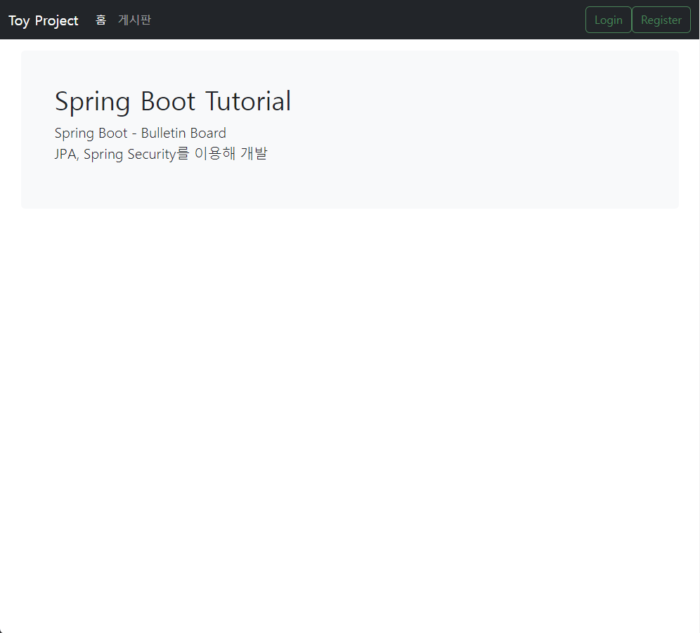
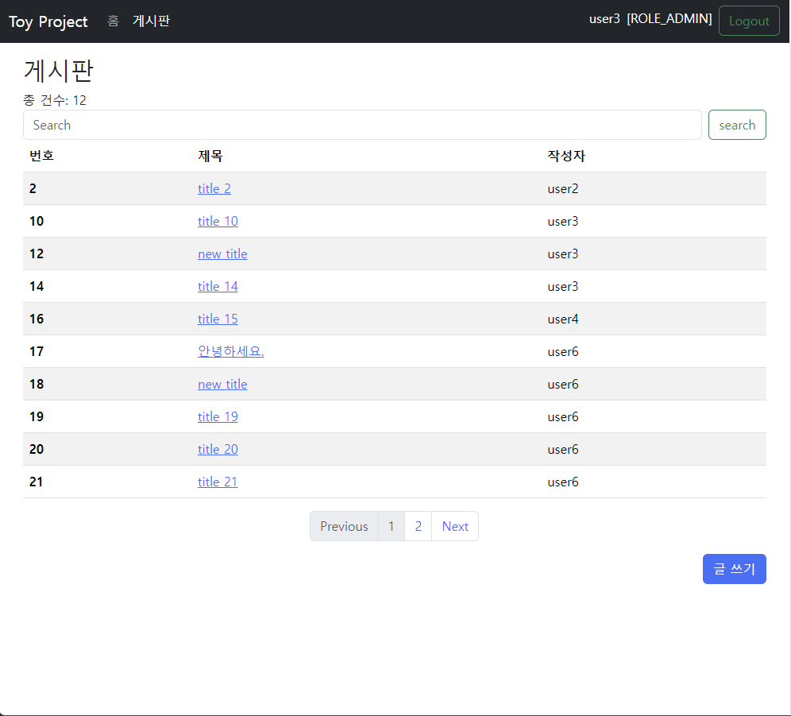
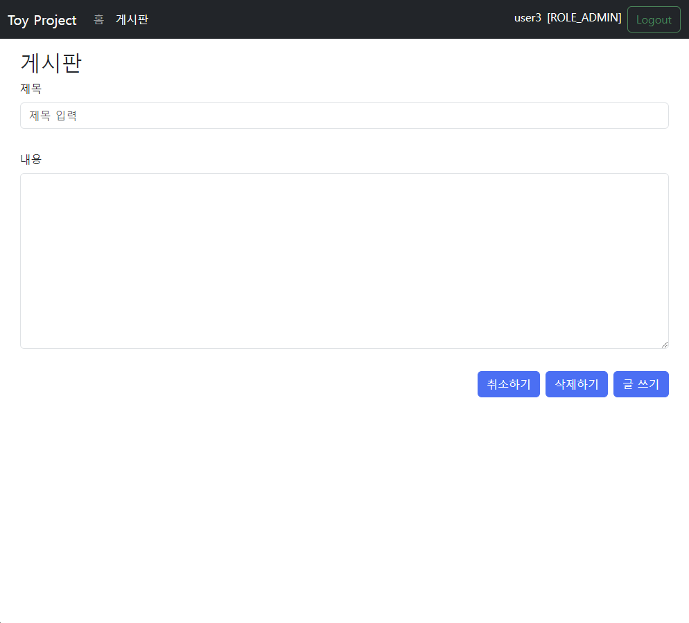
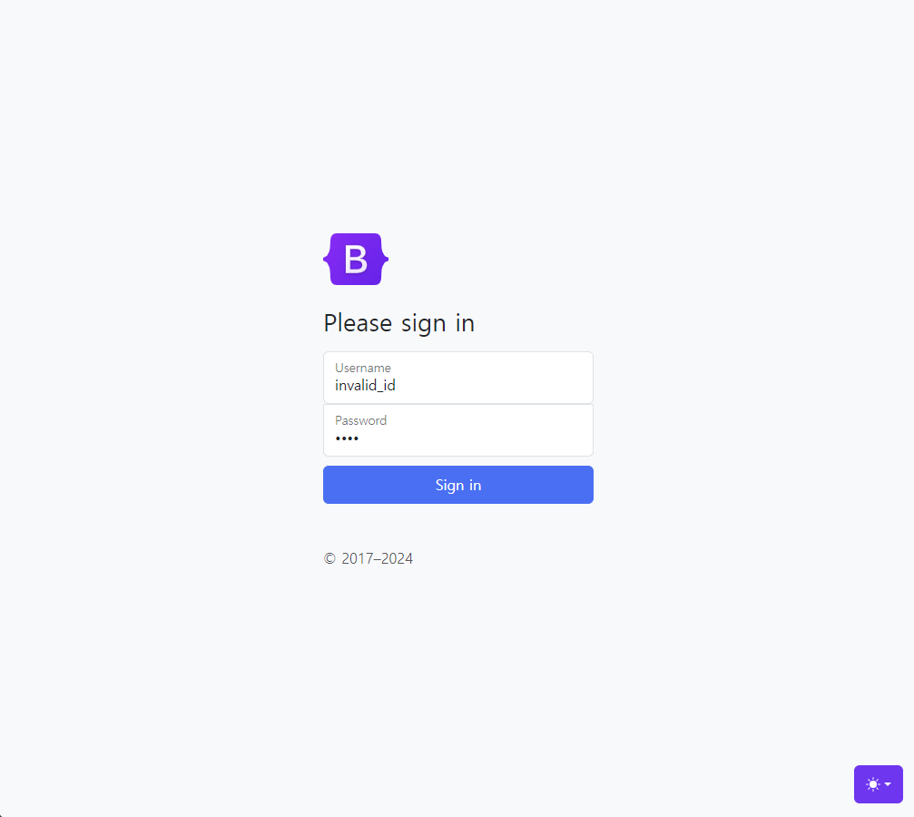
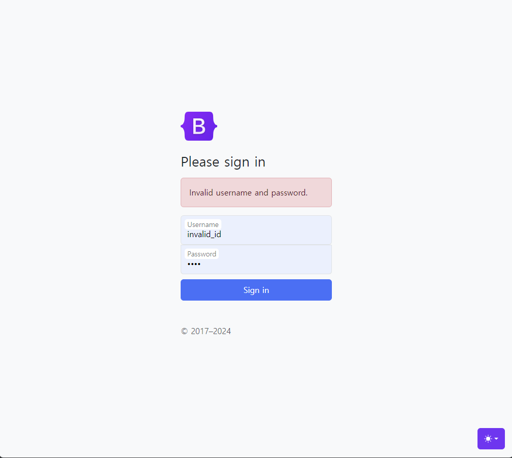

<h1>Toy Project - Bulletin Board</h1>

이 프로젝트는 JPA와 Spring Security를 이용한 간단한 게시판 웹 애플리케이션입니다. 
JPA를 사용하여 연관 관계에 있는 여러 테이블의 데이터를 객체로 묶어서 CRUD 연산을 수행하는 간단한 Spring boot 프로젝트입니다. 

 

## Index
- [Project Overview](#Project-Overview)
- [Project Description](#Project-Description)
- [ER Diagram](#ER-Diagram)
- [Security](#Security)
- [Problems and Solutions](#Problems-and-Solutions)
   

## Project Overview
- 프로젝트명: JPA와 Spring Security를 활용한 기본적인 게시판 웹 애플리케이션 <a href="http://54.180.82.38:8086/" style="font-size: 15px">[해당 프로젝트 바로 가기]</a>
- 프로젝트 기간: 2024.03.03-2024.03.19
- 프로젝트 기술:
    + Backend 
       &nbsp;- OpenJDK 17 
       &nbsp;- MariaDB v11.3.2 
  
    + Frontend 
       &nbsp;- Bootstrap v5.1.3 
       &nbsp;- jQuery v3.7.1 

  + Environment 
      &nbsp;- IntelliJ IDEA Ultimate 2023.2.3 </a>
      &nbsp;- Spring boot v3.2.3 
      &nbsp;- Postman 
      &nbsp;- Git 
      &nbsp;- EC2 (Ubuntu), RDS (MariaDB) 

- 팀 멤버:
    + 박영무 (BE/FE)  [@VoiceofSiren](https://github.com/VoiceofSiren)   
      AJAX (jQuery) / DB / Validation / Security / Deployment  
       

## Project Description
- Back-end를 중점적으로 설명 드리겠습니다.

### Architecture
- 3-Tier 아키텍처를 사용하였습니다.

  <ol>
    <li style="font-size: 20px">Presentation Layer</li>
      <ul>
        <li>Controller, View, Static resources</li>
      </ul>
    <li style="font-size: 20px">Application Layer</li>
      <ul>
        <li>Service Layer</li>
      </ul>
    <li style="font-size: 20px">Data Access Layer</li>
          <ol>
            <li>ORM Framework</li>
              <ul>
                <li>Spring Data JPA (Repository, Entity)</li>
                <li>MyBatis (Mapper, SQL)</li>
              </ul>
            <li>DBMS Connection</li>
              <ul>
                <li>MaraDB (Local DB for Development / RDS for Deployment)</li>
              </ul>
          </ol>
      </ul>
  </ol>

 

### Front-end
- Bootstrap을 활용하여 간단한 레이아웃을 구현하였습니다.

+ UX/UI

<table>
  <thead>
    <tr>
      <th align="center">홈 화면</th>
      <th align="center">로그인 화면</th>
      <th align="center">게시물 조회</th>
      <th align="center">게시물 입력</th>
    </tr>
  <tbody>
    <tr>
      <td align="center"></td>
      <td align="center"></td>
      <td align="center"></td>
      <td align="center"></td>
     <tr/>
  </tbody>
</table>

1. Navigation Bar에 홈 화면과 게시물 화면으로 이동할 수 있는 링크를 추가하였습니다.
2. 현재 접속 중인 페이지에 따라 Navigation Bar의 링크를 활성화/비활성화시키도록 설정하였습니다.  

+ AJAX
  - 로그인 시 입력한 데이터를 검증합니다.
<table>
  <thead>
    <tr>
      <th align="center">OrderDetails</th>
      <th align="center">Cart</th>
    </tr>
  <tbody>
    <tr>
      <td align="center"></td>
      <td align="center"></td>
    <tr/>
  </tbody>
</table>

1. Thymeleaf의 ${param.error} 변수를 사용하였습니다.

### Back-end
- Spring Data JPA, JPQL, MyBatis를 이용하여 DBMS로 CRUD 연산을 수행하였습니다.
- 개발 시에는 로컬 DB에 엑세스하였으며, 배포 단계에서는 AWS EC2 인스턴스에서 RDS에 엑세스하였습니다.

+ ER Diagram

  

 

<h2 align="left">6. Security</h2>

  <ul>
    <li style="font-size: 20px">Spring Security 6 - WebSecurityConfig 클래스</li>
      <ol>
        <li style="list-style-type: decimal">SecurityFilterChain()</li>
          <ol>
            <li style="list-style-type: lower-roman">authorizeHttpRequests()</li>
              <ol style="list-style-type: circle">
                <li>로그인 여부에 따라 특정 경로에 대한 접근 권한을 부여합니다.</li>
              </ol>
            <li style="list-style-type: lower-roman">sessionManagement()</li>
              <ol style="list-style-type: circle">
                <li>세션과 관련하여 다중 로그인을 설정합니다.</li>
                <li>세션 고정 공격으로부터 보호하도록 설정합니다.</li>
              </ol>
          </ol>
    <li style="list-style-type: decimal">bCryptPasswordEncoder()</li>
      <ol>
        <li style="list-style-type: lower-roman">new BCryptPasswordEncoder()</li>
          <ol style="list-style-type: circle">
            <li>단방향 암호화 해시 함수로서 비밀번호를 암호화합니다.</li>
            <li>Bean으로 등록된 해당 객체를 UserService에 주입하여 회원가입 시 호출하여 비밀번호를 암호화합니다.</li>
          </ol>
      </ol>
  </ul>

+ 상품 관련

  <table>
  <thead>
    <tr>
      <th align="center">상품 등록（Admin）</th>
      <th align="center">상품 상세/수정/삭제（Admin）</th>
      <th align="center">상품 목록 조회（User）</th>
      <th align="center">상품 상세（User）</th>
    </tr>
  <tbody>
    <tr>
      <td align="center"></td>
      <td align="center"></td>
      <td align="center"></td>
      <td align="center"></td>
     <tr/>
  </tbody>
  </table>

관리자 페이지에서 상품, 사진, 재고 등을 DB, resource 폴더에 등록하고 클라이언트 페이지에서 해당 데이터를 읽는 형태입니다. 

+ 주문

  <table>
  <thead>
    <tr>
      <th align="center">회원 주문 페이지</th>
      <th align="center">회원 주문 페이지</th>
      <th align="center">회원 주문 페이지</th>
      <th align="center">회원 주문 페이지</th>
    </tr>
  <tbody>
    <tr>
      <td align="center"></td>
      <td align="center"></td>
      <td align="center"></td>
      <td align="center"></td>
     <tr/>
  </tbody>
  </table>

+ 관리자 페이지

  <table>
  <thead>
    <tr>
      <th align="center">관리자 페이지</th>
      <th align="center">회원 목록</th>
      <th align="center">Q&A</th>
    </tr>
  <tbody>
    <tr>
      <td align="center"></td>
      <td align="center"></td>
      <td align="center"></td>
     <tr/>
  </tbody>
  </table>

매출은 보류, 비회원 주문 목록은 아직 버그 문제로 소개하지 못했습니다. 아직 원인을 알 수 없어 추후에 해결하도록 하겠습니다.

+ 인증 (Spring Security 6)

  <table>
  <thead>
    <tr>
      <th align="center">User1의 회원정보 페이지</th>
      <th align="center">권한 외 요청</th>
      <th align="center">Log</th>
    </tr>
  <tbody>
    <tr>
      <td align="center"></td>
      <td align="center"></td>
      <td align="center"></td>
     <tr/>
  </tbody>
  </table>

미인증 사용자의 요청은 회원 로그인 페이지로, 권한이 있는 회원의 요청은 404 오류 페이지를 반환하여 인증을 강화했습니다. 
권한 외 요청이 있을 경우 log4j를 통해 WARN 로그를 남기도록 코드를 작성했습니다. 

해결하지 못한 점 : 일부 페이지에서 Interceptor가 적용되지 않는 현상이 있어 향후 개선해보고자 합니다. 
 

## 리팩토링
- 일부 페이지에서 Interceptor가 적용되지 않는 문제를 해결하기 위한 대안으로 Spring Security 6를 사용할 예정입니다.
    - 이에 따라 사용자 별 권한 부여를 위한 필드를 추가할 예정입니다.
- AWS에 배포할 예정입니다.
- 페이지 처리 버그 개선 예정입니다.
   

## 참고자료
- 제품 사진 360장: https://www.coor.kr/
- 인덱스 페이지 이미지: https://unsplash.com/ko
- 로고: https://www.figma.com/
- Kakao Map API, Kakao 주소 API : https://developers.kakao.com/
- Sweetalert2: https://sweetalert2.github.io/
- SVG 및 폰트: https://fonts.google.com/