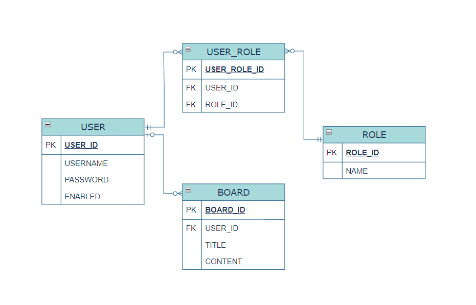

<h1 align="center">Toy Project - Bulletin Board</h1>
<h2 align="left"></h2>

<h2 align="left">Index</h2>

  <ol>
    <li>Topic</li>
    <li>Summary</li>
    <li>Languages and Tools</li>
    <li>Architecture</li>
    <li>ER Diagram</li>
    <li>Security</li>
    <li>Problems and Solutions</li>
  </ol>

<h2 align="left">1. Topic</h2>

  JPA를 사용하여 연관 관계에 있는 여러 테이블의 데이터를 객체로 묶어서 CRUD 연산을 수행하는 간단한 Spring boot 프로젝트입니다.

<h2 align="left">2. Summary</h2>

  <ul>
    <li>Front-end: Bootstrap을 활용하여 간단한 레이아웃을 구현하였습니다.</li>
    <li>Spring Data JPA, JPQL, MyBatis를 이용하여 DBMS로 CRUD 연산을 수행하였습니다.</li>
    <li>개발 시에는 로컬 DB에 엑세스하였으며, 배포 단계에서는 AWS EC2 인스턴스에서 RDS에 엑세스하였습니다.</li>
  </ul>

<h2 align="left">3. Languages and Tools</h2>

   &nbsp;- EC2 (Ubuntu), RDS (MariaDB) 
   &nbsp;- Bootstrap v5.1.3 
   &nbsp;- Github 
   &nbsp;- OpenJDK 17 
   &nbsp;- MariaDB v11.3.2 
   &nbsp;- Postman 
   &nbsp;- Spring boot v3.2.3 

<h2 align="left">4. Architecture</h2>

    &nbsp;&nbsp;&nbsp;- 3-Tier 아키텍처를 사용하였습니다.

  <ol>
    <li style="font-size: 20px">Presentation Layer</li>
      <ul>
        <li>MVC 패턴 기반 Controller, View, Static resources</li>
      </ul>
    <li style="font-size: 20px">Application Layer</li>
      <ul>
        <li>Service Layer</li>
        <li>Data Access Layer</li>
          <ol>
            <li>ORM Framework</li>
              <ul>
                <li>Spring Data JPA (Repository, Entity)</li>
                <li>MyBatis (Mapper, SQL)</li>
              </ul>
            <li>DBMS Connection</li>
              <ul>
                <li>MaraDB RDS</li>
              </ul>
          </ol>
      </ul>
    <li style="font-size: 20px">Support Layer</li>
      <ul>
        <li>Security</li>
          <ul>
            <li>Spring Security 6</li>
          </ul>
      </ul>
  </ol>

<h2 align="left">5. ER Diagram</h2>

  
  

<h2 align="left">6. Security</h2>

  <ul>
    <li style="font-size: 20px">Spring Security 6 - WebSecurityConfig 클래스</li>
      <ol>
        <li style="list-style-type: decimal">SecurityFilterChain()</li>
          <ol>
            <li style="list-style-type: lower-roman">authorizeHttpRequests()</li>
              <ol style="list-style-type: circle">
                <li>로그인 여부에 따라 특정 경로에 대한 접근 권한 부여</li>
              </ol>
            <li style="list-style-type: lower-roman">sessionManagement()</li>
              <ol style="list-style-type: circle">
                <li>다중 로그인 설정 및 세션 고정 공격 보호</li>
              </ol>
          </ol>
    <li style="list-style-type: decimal">bCryptPasswordEncoder()</li>
      <ol>
        <li style="list-style-type: lower-roman">new BCryptPasswordEncoder()</li>
          <ol style="list-style-type: circle">
            <li>단방향 암호화 해시 함수를 이용하여 비밀번호를 암호화</li>
          </ol>
      </ol>
  </ul>

