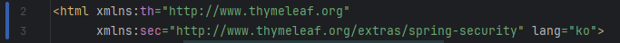
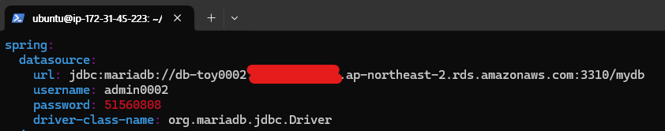
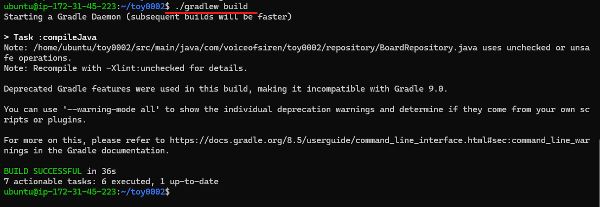
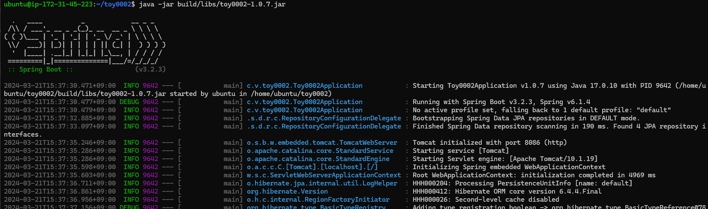

<h1 align="center">Toy Project - Bulletin Board</h1>

&nbsp; - 이 프로젝트는 JPA와 Spring Security를 이용한 간단한 게시판 웹 애플리케이션입니다. 
&nbsp; - JPA를 사용하여 연관 관계에 있는 여러 테이블의 데이터를 객체로 묶어서  
&nbsp;&nbsp;&nbsp; 간단한CRUD 연산을 수행하는 간단한 Spring boot 프로젝트입니다. 

 

## Index
- [Project Overview](#Project-Overview)
- [Project Description](#Project-Description)
- [Depolyment](#Deployment)
- [Problems and Solutions](#Problems-and-Solutions)
 

## Project Overview
- 프로젝트명: JPA와 Spring Security를 활용한 기본적인 게시판 웹 애플리케이션 <a href="http://54.180.82.38:8086/" style="font-size: 15px">[해당 프로젝트 바로 가기]</a>
- 프로젝트 기간: 2024.03.03-2024.03.19
- 프로젝트 기술:
    + Backend 
       &nbsp;- OpenJDK 17 
       &nbsp;- MariaDB v11.3.2 
  
    + Frontend 
       &nbsp;- Bootstrap v5.1.3 
       &nbsp;- jQuery v3.7.1 

  + Environment 
      &nbsp;- IntelliJ IDEA Ultimate 2023.2.3 </a>
      &nbsp;- Spring boot v3.2.3 
      &nbsp;- Postman 
      &nbsp;- Git 
      &nbsp;- EC2 (Ubuntu), RDS (MariaDB) 

- 개발자:
    + 박영무 (BE/FE)  [@VoiceofSiren](https://github.com/VoiceofSiren)   
      AJAX (jQuery) / DB / Validation / Security / Deployment  
 

## Project Description
- Back-end를 중점적으로 설명 드리겠습니다.

### Architecture
- 3-Tier 아키텍처를 사용하였습니다.

  <ol>
    <li style="font-size: 20px">Presentation Layer</li>
      <ul>
        <li>Controller, View, Static resources</li>
      </ul>
    <li style="font-size: 20px">Application Layer</li>
      <ul>
        <li>Service Layer</li>
      </ul>
    <li style="font-size: 20px">Data Access Layer</li>
          <ol>
            <li>ORM Framework</li>
              <ul>
                <li>Spring Data JPA (Repository, Entity)</li>
                <li>MyBatis (Mapper, SQL)</li>
              </ul>
            <li>DBMS Connection</li>
              <ul>
                <li>MaraDB (Local DB for Development / RDS for Deployment)</li>
              </ul>
          </ol>
      </ul>
  </ol>

 

### Front-end
- Bootstrap을 활용하여 간단한 레이아웃을 구현하였습니다.

#### - UX/UI

<table>
  <thead>
    <tr>
      <th align="center">홈 화면</th>
      <th align="center">로그인 화면</th>
      <th align="center">게시물 조회</th>
      <th align="center">게시물 입력</th>
    </tr>
  <tbody>
    <tr>
      <td align="center"></td>
      <td align="center"></td>
      <td align="center"></td>
      <td align="center"></td>
     <tr/>
  </tbody>
</table>

1. Navigation Bar에 홈 화면과 게시물 화면으로 이동할 수 있는 링크를 추가하였습니다.
2. 현재 접속 중인 페이지에 따라 Navigation Bar의 링크를 활성화/비활성화시키도록 설정하였습니다.  

#### - AJAX
  - 로그인 시 입력한 데이터를 검증합니다.
<table>
  <thead>
    <tr>
      <th align="center">유효성 검증 전</th>
      <th align="center">유효성 검증 후</th>
    </tr>
  <tbody>
    <tr>
      <td align="center"></td>
      <td align="center"></td>
    <tr/>
  </tbody>
</table>

1. 유효성 검증을 위해 Thymeleaf의 ${param.error} 변수를 사용하였습니다.

### Back-end
- Spring Data JPA, JPQL, MyBatis를 이용하여 DBMS로 CRUD 연산을 수행하였습니다.
- 개발 시에는 로컬 DB에 엑세스하였으며, 배포 단계에서는 AWS EC2 인스턴스에서 RDS에 엑세스하였습니다.

#### - ER Diagram

  
 

1. USER와 ROLE은 기본적으로 N:M의 연관관계를 가지지만 USER_ROLE이라는 중간 조인 테이블을 설계하여 N:M 연관관계 매핑의 사용을 지양하였습니다.

#### - Entity

<table>
  <thead>
    <tr>
      <th align="center">USER</th>
      <th align="center">USER_ROLE</th>
      <th align="center">ROLE</th>
    </tr>
  <tbody>
    <tr>
      <td align="center"></td>
      <td align="center"></td>
      <td align="center"></td>
    <tr/>
  </tbody>
</table>

1. 조인 테이블인 USER_ROLE이 USER와 ROLE 테이블에 대한 외래키를 가지고 있으므로, USER_ROLE의 참조 필드를 연관 관계의 주인으로 지정하였습니다.
2. 지연 로딩 전략을 사용하여 연관관계에 있는 다른 객체들까지 한꺼번에 조회되는 상황을 방지하였습니다.
 

#### - API
- Entity 객체를 직접 반환하지 않고 별도의 DTO 객체를 반환하는 방식으로 개발하였습니다.

<table>
  <thead>
    <tr>
      <th align="center">게시물 조회 API 요청</th>
      <th align="center">실행된 SELECT문</th>
    </tr>
  <tbody>
    <tr>
      <td align="center"></td>
      <td align="center"></td>
    <tr/>
  </tbody>
</table>
 

#### - Authentication
- Spring Security 6를 사용하였습니다.
    - Bean으로 등록할 SecurityFilterChain 메서드 내부에서 requestMatchers()를 사용하여 로그인한 사용자의 권한에 따라 접근 경로를 제한합니다.
 

#### - Authorization
- Spring Security 6를 사용하였습니다.

<table>
  <thead>
    <tr>
      <th align="center">@EnableWebSecurity WebSecurityConfig 클래스</th>
      <th align="center">Thymeleaf - Spring Security</th>
    </tr>
  <tbody>
    <tr>
      <td align="center"></td>
      <td align="center">
         
        
      </td>
    <tr/>
  </tbody>
</table>

1. 관리자의 권한을 가진 사용자만 게시물을 삭제할 수 있도록 설정하였습니다.
 

## Deployment

### AWS
- EC2와 RDS를 생성하여 배포하였습니다.

#### - RDS
- RDS 설정 파일입니다.

+ application.yml
  

#### - EC2
- jar 파일을 build하여 실행시킵니다.

  
  

## Problems and Solutions
- a 태그의 href의 경로를 수정하였습니다.
- Pagination이 제대로 적용되지 않던 문제를 수정하였습니다.
- AWS에 배포할 예정입니다.
   

